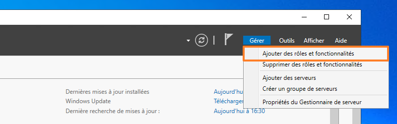
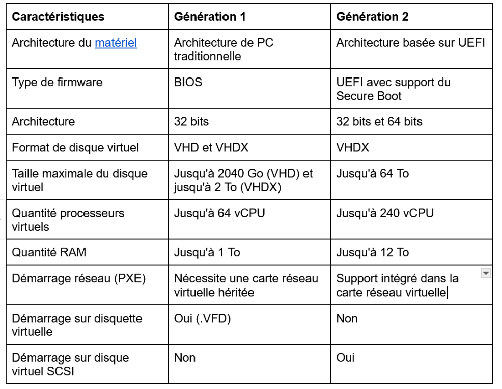

# Job 3
Dans un premier temps il faut créer une vm windows server 2022. Vous pouvez récupérer l’image ici : https://www.microsoft.com/fr-fr/windows-server.
Par la suite il faut réaliser l’installation du rôle Hyper-v sur le serveur pour que celui-ci devienne un hyperviseur.

# Installation
A partir de l’interface graphique : 
Ouvrez le "Gestionnaire de serveur" sur votre futur hyperviseur, puis cliquez sur le bouton "Gérer" puis "Ajouter des rôles et fonctionnalités".

Passez l'étape "Avant de commencer".

Conservez le choix "Installation basée sur un rôle ou une fonctionnalité" à l'étape "Type d'installation". Passez l'étape "Sélection du serveur".

À l'étape "Rôles de serveur", vous devez cocher "Hyper-V" dans la liste. Puis, validez l'installation des fonctionnalités correspondantes aux outils d'administration d'Hyper-V. Autrement dit, ceci va permettre d'ajouter la console "Gestionnaire Hyper-V" ainsi que le module PowerShell pour Hyper-V (ceci ajoute à votre système des commandes PowerShell propre à la configuration d'Hyper-V et des VMs).

Poursuivez... Vous allez arriver sur une étape de configuration nommée "Hyper-V", où vous devrez effectuer la configuration de base de votre hyperviseur.

Le commutateur virtuel (switch virtuel) permet d'assurer la connectivité réseau des machines virtuelles. Sans commutateur virtuel, les machines virtuelles ne peuvent pas être connectées au réseau.
L'assistant d'installation vous propose de créer un premier switch virtuel dès maintenant, en sélectionnant la carte réseau détectée sur la machine. Décochez toutes les cases, et cliquez sur "Suivant". Nous verrons par la suite comment configurer le réseau virtuel.

Ensuite, une étape nommée "Migration" se présente à l'écran. Ceci fait référence à la fonctionnalité d'Hyper-V permettant de migrer des ordinateurs virtuels d'un hyperviseur vers un autre (envoyer ou recevoir).  
  
Cette fonctionnalité peut être activée, désactivé et configurée à tout moment, décochez l’option pour le moment. Nous y reviendrons plus tard.  

Puis, la dernière étape nommée "Emplacements par défaut" s'affiche à l'écran. Il est recommandé de stocker les fichiers relatifs aux machines virtuelles sur un volume dédié et différent de celui du système. Selon les configurations, il peut s'agir d'un volume local ou d'un volume associé à une cible distante (via iSCSI, par exemple).  
Le répertoire "Virtual Hard Disks" sera utilisé par Hyper-V pour stocker tous les disques virtuels associés aux VMs d'Hyper-V. Ceci correspond aux fichiers avec l'extension VHDX, ou le format plus ancien VHD. Le répertoire pour les fichiers de configuration contiendra le fichier de configuration de la VM au format XML, mais aussi un fichier BIN pour stocker la mémoire d'une VM dans un état sauvegardé, ou encore les fichiers AVHDX (et AVHD) pour les snapshots. Nous verrons par la suite que tout cela est personnalisable.  
Voici un exemple de configuration où nous utilisons le volume "V:" du serveur pour stocker les données correspondantes à nos machines virtuelles :

Poursuivez jusqu'à la fin... Lancez l'installation et patientez un instant.
Lorsque l'installation est terminée, vous devez redémarrer le serveur pour finaliser l'installation du rôle Hyper-V.

# Création Debian via l’interface graphique Hyper-V.

1 - La liste de tous les serveurs Hyper-V auxquels vous êtes actuellement connectés.
2 - La liste de tous les ordinateurs virtuels de l'hôte sélectionné à gauche.
3 - La liste de toutes les actions disponibles.  
  
Pour donner accès à internet a notre future VM on va créer un commutateur virtuel.  
La gestion des commutateurs virtuels se fait via le "Gestionnaire Hyper-V". Pour créer un nouveau commutateur virtuel, vous devez cliquer sur « Gestionnaire de commutateur virtuel… » disponible dans le menu des Actions sur la droite de la console.

Nous allons créer un commutateur virtuel de type « Externe ». Sur la gauche, cliquez sur « Nouveau commutateur réseau virtuel » et choisissez le type de commutateur "Externe". Une fois que c'est fait, cliquez sur le bouton « Créer le commutateur virtuel ».

Définissez un nom à ce commutateur virtuel. Cochez l’option importante nommée « Autoriser le système d’exploitation de gestion à partager cette carte réseau ». Lorsqu’elle est active, c'est-à-dire cochée, vous autorisez le système d'exploitation de l'hôte Hyper-V à utiliser l'adaptateur réseau physique associé au commutateur virtuel externe. Ceci signifie qu'un même adaptateur réseau physique est partagé entre les machines virtuelles et le système de gestion d'Hyper-V. 

Cliquez sur "OK" pour créer le commutateur virtuel avec les paramètres sélectionnés. Lors de la création d'un commutateur de type « Externe », vous obtiendrez un message d'avertissement. Cliquez sur "Oui", mais sachez que ceci va "couper" le réseau une dizaine de secondes sur votre Hyper-V.

# Création de la VM Debian

À chaque fois que vous allez créer une machine virtuelle sur Hyper-V, vous devrez choisir entre la Génération 1 et la Génération 2.

On va utiliser la Génération 2.
Passons à la création de la machine virtuelle. Ouvrez la console "Gestionnaire Hyper-V", effectuez un clic droit sur le nom du serveur. Sous "Nouveau", choisissez : "Ordinateur virtuel...". Un assistant va s'exécuter.

Passez la première étape nommée "Avant de commencer" en cliquant sur le bouton "Suivant".

Ensuite, vous devez nommer cette VM. Il s'agit du nom de l'ordinateur virtuel tel qu'il apparaitra dans la console Hyper-V. Si vous souhaitez que ce nom soit également utilisé au sein du système d'exploitation, c'est à vous de configurer le système après son installation (il n'y a aucun "héritage").

Je vous recommande de cocher l'option "Stocker l'ordinateur virtuel à un autre emplacement", même si vous ne modifiez pas l'emplacement. Pourquoi ?
Tout simplement parce que ceci va changer le comportement d'Hyper-V. Sous "V:\Hyper-V\", il va créer un sous-dossier portant le nom de la VM, et dans ce dossier, il créera deux répertoires : "Virtual Hard Disks" et "Virtual Machines". Ainsi, pour chaque VM, nous aurons un répertoire global avec tous les fichiers associés à la VM en question, ce que je trouve beaucoup plus cohérent en termes d'organisation.

Ensuite, vous devez "Spécifier la génération", et choisir entre la génération 1 et la génération 2. Nous pouvons choisir "Génération 2".

À l'étape suivante, vous devez définir une quantité de mémoire vive (RAM) pour cette machine virtuelle.Indiquez 1024 Mo.

À l'étape "Configurer la mise en réseau", vous devez choisir un commutateur virtuel sur lequel connecter la carte réseau virtuelle de la VM. Si vous conservez la valeur "Non connecté", la VM sera créé, mais elle sera déconnectée de tout réseau. Ici, nous allons choisir le vSwitch externe "LAN-Physique" créé précédemment.

À l'étape "Connecter un disque dur virtuel", vous devez configurer le stockage principal de la VM. Autrement dit, vous devez paramétrer le disque dur virtuel (VHDX) de la VM sur lequel nous viendrons installer le système d'exploitation par la suite.

La dernière étape se présente à vous : "Options d'installation". Ici, cochez l'option "Installer un système d'exploitation à partir d'un fichier de démarrage" et cliquez sur le bouton "Parcourir..." pour aller chercher l'image ISO d'installation de Debian.

Lorsque vous arrivez à l'étape "Résumé", cliquez sur "Terminer" pour finaliser la création de l'ordinateur virtuel.

# Installer le système d’exploitation.
Pour lancer l'installation du système d'exploitation, vous devez démarrer la VM. Mais avant cela, connectez-vous à la console de la VM. Effectuez un clic droit sur son nom, puis cliquez sur "Se connecter...".

 - Procédé a une installation classique de Debian.

Spécificité des VM :  
Pour windows serveur 2022 la configuration matérielle requise est :  
 - Processeur 1,4 GHz 64 bits  
 - 2 Go pour Serveur avec interface de bureau  
 - 32 Go d’espace  
