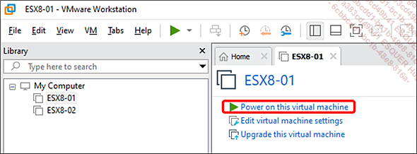
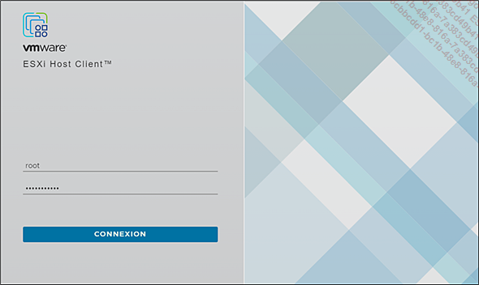
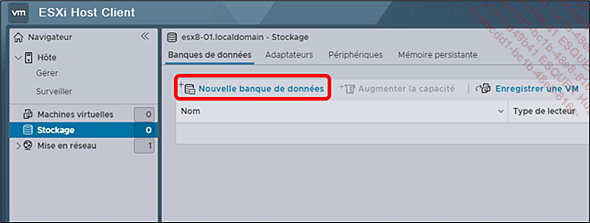
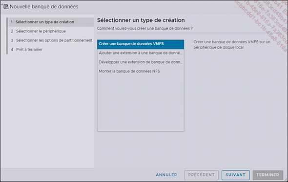
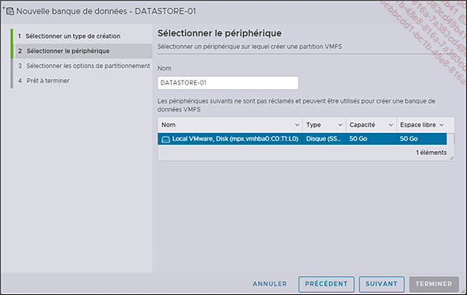
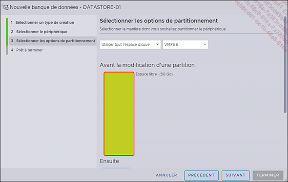
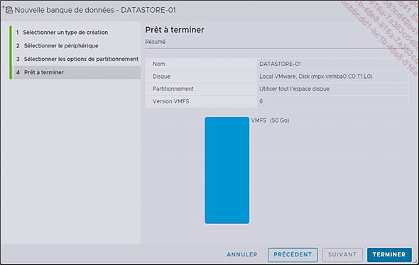

# Création d’une banque de données sur un hôte ESXi
En ce qui concerne le stockage, nous avons créé un disque virtuel sur notre hôte, mais pour disposer d’un pool de ressources de stockage qui puisse être partagé entre les machines virtuelles, il faut créer une banque de données (datastore).  
## L’assistant de création d’une banque de données
Pour créer notre premier datastore, revenons à VMware Workstation et démarrons notre machine virtuelle ESXi si ce n’est pas déjà fait.  

 Positionnez le curseur de votre souris sur ESX8-01 et appuyez sur Power on this virtual machine ou simplement sur le bouton vert sur le ruban.  
  

 Lorsque votre serveur ESXi est démarré, ouvrez votre navigateur préféré et rendez-vous à l’adresse que vous lui aviez assignée préalablement.  

 Connectez-vous à l’interface web ESXi Host Client avec le compte root.  
  

 Dans la section de navigation, ouvrez l’objet Hôte et sélectionnez Stockage. Appuyez sur Nouvelle banque de données.  
  

 Laissez l’option Créer une banque de données VMFS et appuyez sur SUIVANT.  
  

 Sous Nom, donnez un nom à la banque de données, ici DATASTORE-01 et sélectionnez le deuxième disque que vous avez créé à cet effet. Appuyez sur SUIVANT.  
  

 Dans les options de partitionnement, laissez les valeurs par défaut (Utiliser tout l’espace disque et VMFS 6), puis appuyez sur SUIVANT.  
  

 Prenez connaissance du Résumé et appuyez sur TERMINER.  
  

 Une fenêtre d’avertissement vous indiquera que le contenu du disque sera effacé. Appuyez sur OUI pour continuer.  
  
