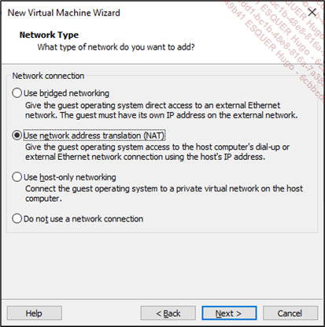

# Création de la machine virtuelle VMware ESXi

Maintenant que nous disposons du fichier .iso de ESXi, nous pouvons installer l’hyperviseur sur une machine virtuelle dans Workstation Pro.  

 Double cliquez sur le raccourci de Workstation Pro 1.  

 Sous l’onglet Home, appuyez sur Create a New Virtual Machine.  
  

L’assistant de création d’une machine virtuelle se lance.  

 Cochez l’option Custom (advanced) et appuyez sur Next.  
  

 Dans le menu déroulant Hardware compatibility, sélectionnez ESXi 7.0 et appuyez sur Next. La version 8 est rétrocompatible.
  

 Cochez l’option Installer disc image file (iso). Cliquez sur Browse pour sélectionner le fichier .iso de ESXi téléchargé précédemment et appuyez sur Next.  
  

 Cochez VMware ESX en tant que Guest operating system. Assurez-vous que la version 7 est sélectionnée et appuyez sur Next.  
  

 Donnez un nom à votre machine virtuelle et modifiez au besoin l’emplacement où ses fichiers seront stockés. Appuyez sur Next.  
  

 Laissez le nombre de processeurs et de cœurs par défaut et appuyez sur Next.  
  

 La quantité de RAM par défaut est de 4 Go. Si vous pouvez vous permettre 8 Go, n’hésitez pas à augmenter la quantité, sinon appuyez sur Next.  
  

 Laissez la valeur par défaut à Use network address translation (NAT) et appuyez sur Next.  
  

 Laissez la valeur Paravirtualized SCSI par défaut et appuyez sur Next.  
  

 Laissez la valeur SCSI par défaut et appuyez sur Next.  
  

 Cochez Create a new virtual disk et appuyez sur Next.  
  

 Allouez un minimum de 5 Go pour le disque qui sera utilisé pour l’installation de ESXi.  

 Décochez Allocate all disk space now et cochez Store virtual disk as a single file pour avoir de meilleures performances. Appuyez sur Next.  
  

 Modifiez l’emplacement du fichier du disque virtuel (.vmdk) au besoin et appuyez sur Next.  
  

 Validez les informations de création de la machine virtuelle et appuyez sur Finish.  
  
## Activation du moteur de virtualisation

Dans un contexte de virtualisation imbriquée, il faut « faire croire » à l’hyperviseur qu’il a accès à des processeurs qui lui permettent de faire de la virtualisation comme s’il était installé sur un hôte physique. À cette fin, Workstation Pro offre des options pour que le moteur de virtualisation (virtualization engine) utilise les technologies Intel VT-x/EPT ou AMD-V/RVI.  

 À partir de l’onglet Home de Workstation Pro, cliquez sur votre nouvelle machine virtuelle ESXi dans la colonne Library et appuyez sur Virtual Machine Settings.  
  

 Dans la fenêtre Virtual Machine Settings, cochez Virtualize Intel VT-x/EPT or AMD-V/RVI dans la section Virtualization engine et appuyez sur OK.  
  
## Ajout d’un disque dur à la machine virtuelle ESXi

Avant de procéder à l’installation de ESXi, nous allons créer un autre disque qui servira à allouer de l’espace de stockage aux machines virtuelles. Ceci nous permettra de créer un datastore, c’est-à-dire un conteneur logique de ressources de stockage partagé.  

 À partir de l’onglet Home de Workstation Pro, cliquez sur votre nouvelle machine virtuelle dans la colonne Library et appuyez sur Virtual Machine Settings comme dans la sous-section précédente.  

 Dans la fenêtre Virtual Machine Settings, sélectionnez Hard Disk (SCSI) sous l’onglet Hardware et appuyez sur Add.  
  

 Dans l’assistant Add Hardware Wizard, choisissez Hard Disk et appuyez sur Next.  
  

 Laissez la valeur SCSI par défaut et appuyez sur Next.  
  

 Cochez Create a new virtual disk et appuyez sur Next.  
  

 Environ 40 Go sont requis pour créer la machine virtuelle qui permettra d’illustrer le propos. De l’espace disque supplémentaire sera nécessaire si vous souhaitez déployer un serveur vCenter (cf. chapitre Déploiement d’un serveur VMware vCenter).  

 Décochez Allocate all disk space now et cochez Store virtual disk as a single file pour avoir de meilleures performances. Appuyez sur Next.  
  

 Modifiez l’emplacement du fichier du disque virtuel (.vmdk) au besoin et appuyez sur Finish.  
  

Le nouveau disque s’ajoute dans la fenêtre Virtual Machine Settings.  
  
