# Préparation au déploiement de la machine virtuelle

Avant de lancer l’assistant, nous allons créer un répertoire dans la banque de données DATASTORE-01 que nous avons créée plus tôt pour y télécharger le fichier ISO. Cette tâche est facultative, car il est possible d’ajouter des fichiers à la racine du datastore, mais elle nous permettra de découvrir certaines fonctionnalités de la section stockage de la console ESXi Host Client.  
## Création d’un répertoire sur une banque de données

En un premier temps, assurez-vous que l’hôte ESXi que vous avez déployé précédemment est bien démarré, puis suivez les étapes suivantes.  

 Entrez l’adresse IP ou le nom d’hôte de votre serveur ESXi dans votre navigateur préféré et connectez-vous à l’interface de gestion web avec le compte root.  
  

 Pour créer un nouveau répertoire dans une banque de données, rendez-vous à la section Stockage de la console ESXi Host Client et cliquez sur la banque de données DATASTORE-01 précédemment créée.  
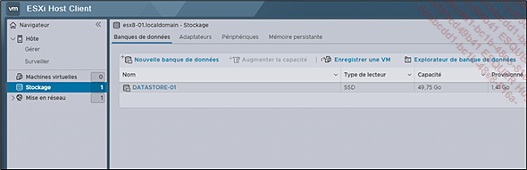  

 Appuyez sur Explorateur de banque de données.  
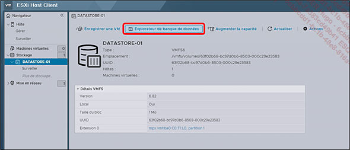  

 Dans la fenêtre Explorateur de banque de données, appuyez sur Créer un répertoire.  
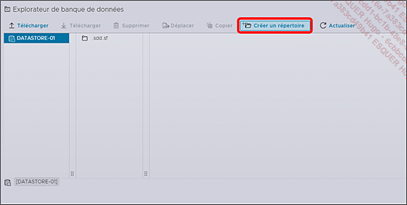  

 Donnez un nom à votre nouveau répertoire dans le champ Nom du répertoire et appuyez sur CRÉER UN RÉPERTOIRE.  
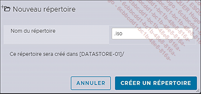  
## Téléchargement du fichier ISO d’installation dans le répertoire

Maintenant que nous disposons d’un répertoire, nous pouvons lancer le téléchargement des sources d’installation du système d’exploitation que nous avons récupérées.  

 Sélectionnez le nouveau répertoire (.iso dans cet exemple) et appuyez sur Télécharger.  
  

 Votre explorateur de fichiers s’ouvre. Naviguez vers le répertoire où vous avez déposé le fichier ISO de Windows Server 2022 (par défaut : %USERPROFILE%\Downloads\), sélectionnez-le et appuyez sur Ouvrir.  
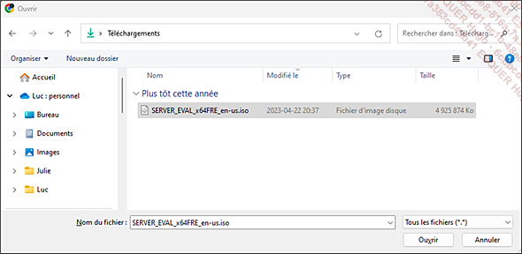  

 Appuyez sur FERMER en bas de la fenêtre Explorateur de banque de données pour terminer la tâche.  
  

 Vous pouvez suivre l’avancement de la tâche au bas de la page dans la section Tâches récentes.  
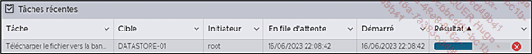  
# Création d’une machine virtuelle en mode interactif

Pendant le téléchargement, vous pouvez lancer l’assistant de création d’une machine virtuelle.  

 Si ce n’est pas déjà fait, connectez-vous à l’interface de gestion ESXi Host Client avec l’utilisateur root.  

 Dans la section Navigateur, faites un clic-droit sur l’objet Hôte et appuyez sur Créer/Enregistrer une VM.  
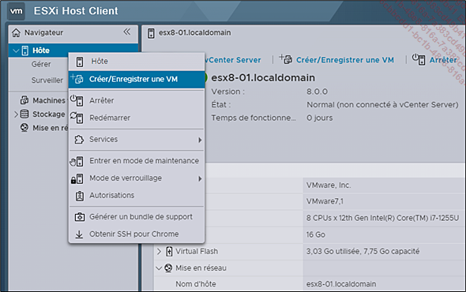  

 Laissez l’option Créer une machine virtuelle par défaut et appuyez sur SUIVANT.  
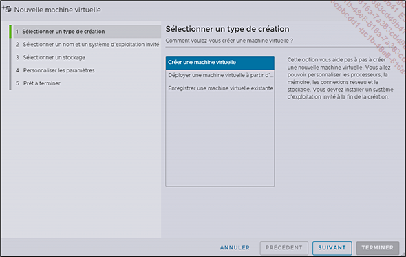  

 Nommez votre machine virtuelle sous Nom et laissez la compatibilité à Machine virtuelle ESXi 8.0.  
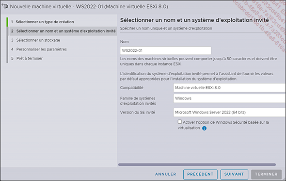  

Le paramètre de compatibilité (Virtual Machine Compatibility) permet de sélectionner la version de l’hôte ESXi sur lequel la machine virtuelle va s’exécuter. Cette option fait référence aux composants matériels virtualisés disponibles pour une machine virtuelle (processeur, mémoire, adaptateurs réseau et contrôleurs de stockage) en fonction de la version du logiciel ESXi. Le matériel virtuel comprend également d’autres composants comme le BIOS et l’EFI (Extensible Firmware Interface), l’emplacement des bus PCI virtuels disponibles ou le nombre de processeurs et la quantité de mémoire autorisés.  

Notez toutefois que certains systèmes d’exploitation plus anciens pourraient nécessiter une version antérieure de ESXi. Le cas échéant, il vous suffirait de cliquer dans l’espace blanc de la section compatibilité pour faire apparaître les autres versions.  
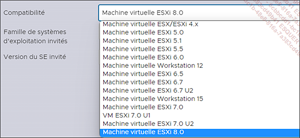  

 Cliquez dans l’espace blanc de la section Famille de systèmes d’exploitation invités et sélectionnez Linux.  
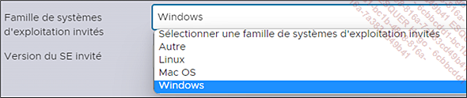  

 Cliquez dans l’espace blanc de Version du SE invité et sélectionnez Debian (64 bits).  

 Lorsque vous avez renseigné tous les champs, appuyez sur SUIVANT.  

 À l’étape Sélectionner un stockage, choisissez la banque de données DATASTORE-01 et appuyez sur SUIVANT.  
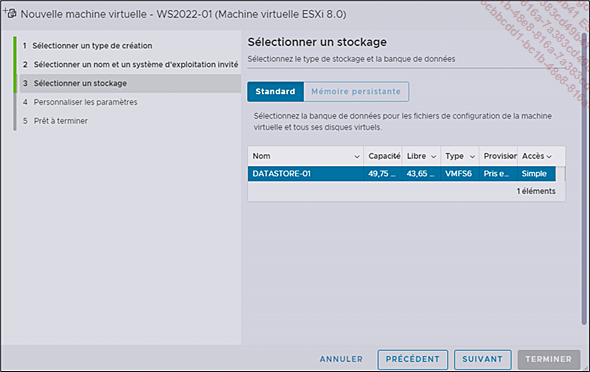  

L’étape Personnaliser les paramètres vous permet de faire l’attribution des ressources virtuelles. Il suffit de renseigner les champs CPU, Mémoire, Disque dur 1 en fonction des ressources que vous avez attribuées à votre serveur ESXi.  

Dans notre exemple, nous avons choisi d’attribuer 2 CPU, 8 Go de RAM et 40 Go d’espace pour le disque 1, car notre serveur hôte est dimensionné en conséquence.  

Si vous ne pouvez pas vous permettre ces valeurs, vous aurez des performances minimales acceptables en optant pour la configuration suivante : 1 CPU, 1 Go de RAM et 8 Go d’espace pour le disque 1.  
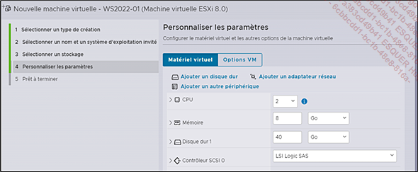  

 Après avoir renseigné les champs CPU, Mémoire et Disque dur 1, ouvrez la section Disque dur 1 pour choisir le type de provisionnement du disque.  

Comme vous pouvez le constater sur la prochaine capture d’écran, vous aurez le choix entre trois options de provisionnement. Avant de poursuivre, prenons un instant pour donner quelques précisions sur chacune d’entre elles parce qu’elles ont un impact sur le mode de gestion du stockage :  

    À provisionnement dynamique (Thin Provision) : cette option permet d’économiser de l’espace disque puisqu’elle en fait l’allocation à mesure que l’espace est utilisé.  

    À provisionnement statique, mise à zéro tardive (Thick Provision Lazy Zeroed) : cette option alloue l’espace disque dans son entièreté lors de la création, mais n’efface pas les données du disque physique avant la première utilisation. La mise à zéro signifie que les blocs du disque se font assigner la valeur zéro. Ce type de provisionnement offre de meilleures performances que le précédent.  

    À provisionnement statique, mise à zéro imminente (Thick Provision Eager Zeroed) : cette option alloue l’entièreté du disque et tous les blocs du disque physique sont mis à zéro dès la création. Ce type de provisionnement est recommandé pour certaines options de clustering. L’initialisation du disque prend plus de temps et l’ajout d’espace éventuel peut affecter le temps de réponse des disques.  

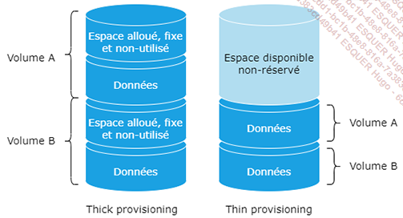  

Pour notre exemple, nous laisserons la valeur par défaut, c’est-à-dire À provisionnement statique, mise à zéro tardive. Si votre espace disque est limité, il faudra opter pour le provisionnement dynamique.  

Notez au passage qu’une machine virtuelle possède aussi des contrôleurs de stockage (SCSI) comme s’il s’agissait d’une machine physique. L’assignation des contrôleurs commence toujours par zéro (0:0). Si un deuxième disque est ajouté, il aura le contrôleur 0:1 et ainsi de suite.  
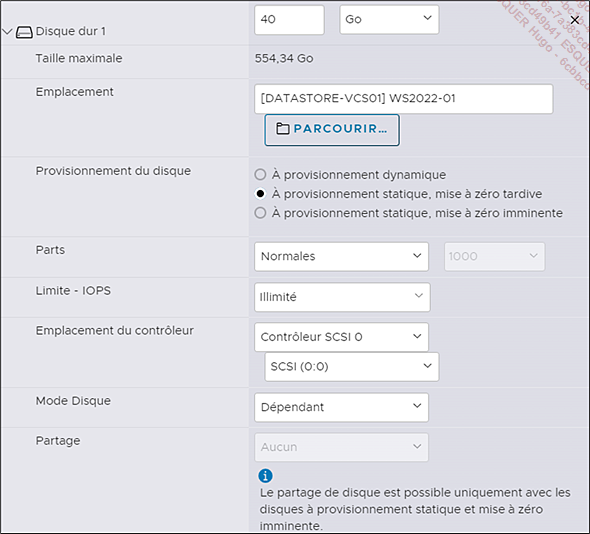  

Après avoir configuré le stockage, passons maintenant à la configuration du réseau.  

 Ouvrez la section Adaptateur réseau 1 et sélectionnez l’adapteur VMXNET 3 au lieu de E1000e qui est choisi par défaut.  

Le choix de l’adapteur réseau peut varier selon les besoins et le système d’exploitation utilisé. Voici quelques précisions sur ces deux composants :  

    VMXNET3 est une carte réseau paravirtualisée. Elle offre des performances élevées et une faible utilisation du processeur en déléguant certaines tâches à la carte réseau physique de l’hôte. Cet adapteur comprend des fonctionnalités avancées telles que la prise en charge de plusieurs files d’attente ou l’utilisation de trames Ethernet qui dépassent le format standard de 1500 octets (« trames géantes » ou jumbo frames).  

    E1000e est une carte réseau émulée qui permet de simuler une carte physique Intel spécifique. Elle ne dispose pas d’autant de fonctionnalités avancées que la précédente, mais elle offre une compatibilité avec un plus grand nombre de systèmes d’exploitation.  

Par défaut, l’attribution de l’identifiant unique du contrôleur de l’interface réseau ou adresse MAC (Media Access Control) se fait automatiquement.  
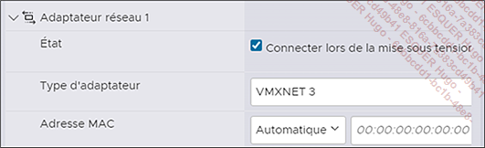  

 Après avoir choisi l’adapteur réseau, rendez-vous plus bas à la section Lecteur de CD/DVD1 pour monter le fichier ISO de Debian. Appuyez sur Périphérique hôte et sélectionnez Fichier ISO banque de données pour accéder à l’Explorateur de banque de données.  
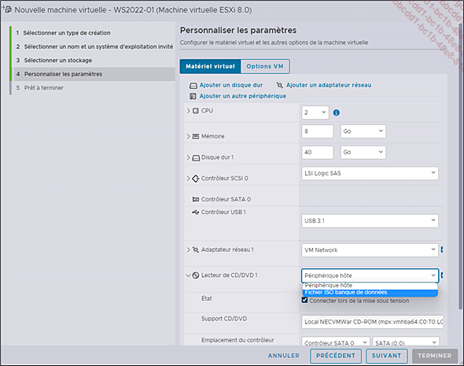  

Le comportement de la machine virtuelle est identique à celui d’un ordinateur physique : l’installation d’un système d’exploitation se fait à partir d’un CD ou un DVD comme s’il avait été gravé et inséré dans un lecteur physique.  

L’installation d’un OS via un CD/DVD est la méthode privilégiée (et la plus simple) dans un environnement VMware. Il est possible de le faire avec une clé USB physique qui peut être détectée par la machine virtuelle. Dans ce cas, il faudra aussi changer l’ordre d’amorçage (boot) dans le BIOS, comme pour un serveur physique.  

 Dans l’Explorateur de banque de données, choisissez le DATASTORE-01 et naviguez dans l’arborescence pour retrouver le répertoire .iso créé précédemment. Sélectionnez le fichier ISO et appuyez sur SÉLECTIONNER.  
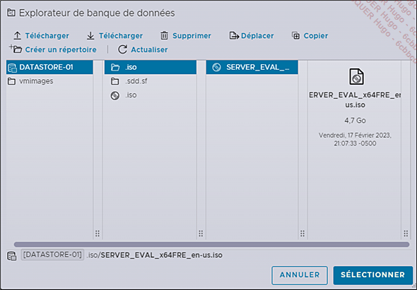  

 Le nom du fichier ISO apparaît dans le champ Support CD/DVD. Appuyez sur SUIVANT.  
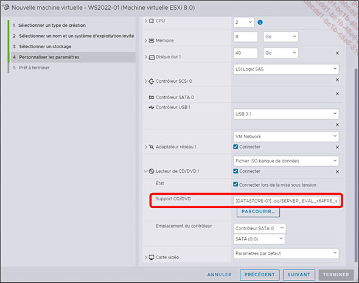  

Le lecteur de CD/DVD est connecté par défaut, mais il est toujours préférable de le confirmer avant d’en faire l’utilisation. Il s’agit d’un oubli fréquent, alors assurez-vous qu’il soit bien coché lorsque vous en avez besoin !  

La dernière étape, Prêt à terminer, vous permet de confirmer les configurations que vous avez faites dans les étapes précédentes. Si toutes les valeurs correspondent à vos choix, appuyez sur TERMINER. Si vous souhaitez modifier votre configuration, il suffit d’appuyer sur PRÉCÉDENT, de faire la correction et de revenir à l’étape 5.  

Vous pouvez toujours modifier votre configuration après le déploiement à partir de l’option Modifier les paramètres dans le menu de la VM.  
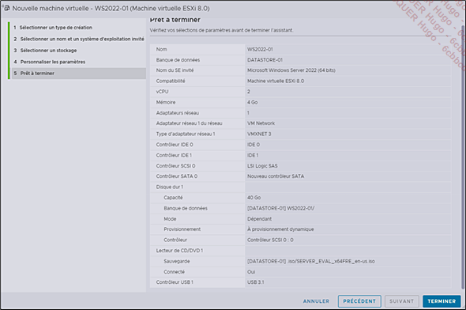  

Vous pouvez suivre la progression de la tâche dans la section Tâches récentes au bas de la page.  
