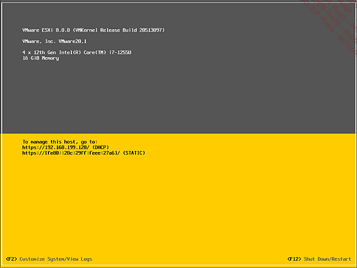
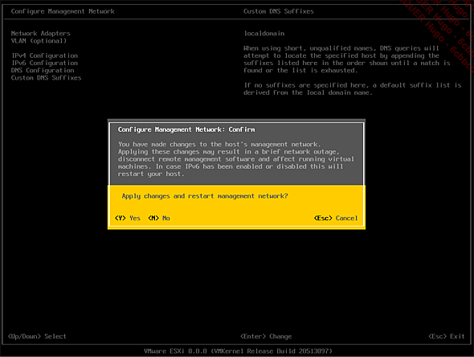

# Lancement de l’installation

 Dans Workstation Pro, cliquez sur votre nouvelle machine virtuelle dans la colonne Library et appuyez sur Power on this virtual machine.  
  

 Une fois arrivé au VMware ESXi 8.0.0 Installer, cliquez à l’intérieur de la console pour interagir avec la machine virtuelle. Pour sortir de la console et retourner sur le bureau, appuyez sur les touches [Ctrl][Alt].  

Le programme d’installation de ESXi ne fonctionne pas avec la souris. Vous devez appuyer sur les touches indiquées à chaque étape.  
  

 Appuyez sur [Entrée] pour commencer la procédure d’installation.  
  

 Appuyez sur [F11] pour accepter le contrat de licence du logiciel.  
  

 Sélectionnez le disque installé lors du déploiement initial (le moins volumineux) et appuyez sur [Entrée].  
  

 Sélectionnez la disposition du clavier et appuyez sur [Entrée].  
  

 Entrez un mot de passe complexe pour l’utilisateur root. Il doit être composé d’un minimum de sept caractères incluant au moins un chiffre, une majuscule et un caractère spécial. Appuyez sur [Entrée].  
  

 Confirmez que vous souhaitez procéder à l’installation en appuyant sur [F11].  
  

L’installation a été complétée avec succès. Avant de redémarrer la machine, vous devez retirer le média d’installation.  
  

 Rendez-vous sur l’objet de votre machine virtuelle, faites un clic droit et appuyez sur Settings.  
  

 Dans la fenêtreVirtual Machine Settings, rendez-vous sur CD/DVD (IDE) et décochez la case Connected dans la section Device Status. Revenez à l’interface de votre machine ESXi et appuyez sur [Entrée] pour redémarrer le serveur.  
  
# Configuration du réseau

Après le redémarrage, vous verrez bientôt l’interface DCUI (Direct Console User Interface) de ESXi. C’est à partir de cette interface que nous allons maintenant appliquer les configurations réseau et DNS de l’hyperviseur.  

 Cliquez dans l’écran de la console et appuyez sur [F2] pour configurer le système.  
  

 Authentifiez-vous avec l’utilisateur root et le mot de passe défini précédemment.  
  

ESXi peut fonctionner en DHCP (attribution automatique d’adresses IP), mais il est préférable de lui assigner une adresse fixe pour faciliter l’accès à l’interface web que nous verrons sous peu.  

 Sur la page System Customization, sélectionnez Configure Management Network et appuyez sur [Entrée].  
  

 Appuyez sur IPv4 Configuration.  
  

 Descendez jusqu’à Set static IPv4 address and network configuration et cochez l’option en appuyant sur la barre d’espace.  

 Vous pouvez laisser l’adresse attribuée automatiquement par votre box ou en attribuer une autre dans le même sous-réseau. Appuyez sur [Entrée].  
  
# Configuration du DNS et du nom d’hôte

 Appuyez maintenant sur DNS Configuration.  
  

 Descendez jusqu’à Use the following DNS server addresses and hostname et cochez l’option en appuyant sur la barre d’espace. Ceci permettra de configurer votre box comme serveur DNS par défaut. Appuyez sur [Entrée].  

Vous pouvez également renommer le serveur sous Hostname.  
  

 Si vous souhaitez assigner un suffixe DNS à votre serveur, appuyez sur Custom DNS Suffixes et modifiez le suffixe par défaut.  
  

 Lorsque les configurations par défaut sont complétées, appuyez sur [Échap].  

 Entrez [ Y ] (Yes) pour confirmer le changement de configuration.  
  

 Appuyez à nouveau sur la touche d’échappement ([Echap]) sur la page System Customization pour revenir à l’interface principale DCUI.  

 Notez l’URL pour ouvrir la console web de gestion de l’hôte.  
  
# Connexion à la console web ESXi Host Client

Nous pouvons enfin accéder à l’interface de gestion ESXi Host Client de notre nouvel hôte.  

 Ouvrez votre navigateur préféré et entrez l’URL notée à l’étape précédente.  

 Ignorez l’avertissement et continuez dans les paramètres avancés pour accéder à l’interface de gestion.  
  

 Authentifiez-vous avec le compte root.  
  

 Vous êtes maintenant dans la console ESXi Host Client. 
  
