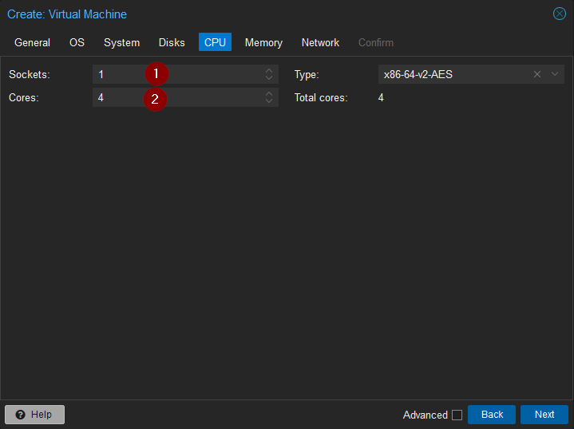

# Installer Proxmox VE 8.1

Brancher la Clé USB sur votre serveur  
Démarrer la machine en prenant soin de « Booter » sur la Clé USB  
Voir la documentation du Bios de votre Carte mère  
   
Sélectionner « Install Proxmox VE (Graphical) ».  
  
Cliquer sur « I agree » (si vous acceptez les conditions d’utilisation).  
  
Sélectionner le disque sur lequel sera installé Proxmox VE.  
Cliquer sur « Options » pour configurer le partitionnement.  
  
– Sélectionner le « Filesystem » par défaut « ext4 » (ou un autre si besoin).  
– Définir une taille maximale « maxroot » pour le volume logique qui contiendra le système (Ex : 20 GB). Si aucune valeur n’est définie pour « maxroot », 1/4 du disque sera utilisé (ne pas définir cette valeur entraînerait un gaspillage plus ou moins important selon la taille des disques).  
– Cliquer sur « Next ».  
  
Sélectionner la langue et les autres options de region.  
Cliquer sur « Next ».  
  
Renseigner un mot de passe pour l’utilisateur root et l’adresse e-mail de réception pour les alertes.  
Cliquer sur « Next ».  
  
Sélectionner l’interface réseau.  
Renseigner le nom de machine et la configuration réseau.  
Cliquer sur « Next ».  
  
Vérifier le résumé et cliquer sur « Install ».  
  
Une fois l’installation terminée, le terminal s’affiche.  

L’interface de Proxmox VE est accessible depuis un navigateur web.  
Il faudra utiliser l’adresse présente sur la page de démarrage.  
https://AdresseIPProxmoxVe:8006  
  
Ce message risque de s’afficher car le certificat n’est pas valide.  
Cela n’empêche pas le fonctionnement de Proxmox VE.  
Le message peut être ignoré si vous accédez à Proxmox VE depuis un réseau fiable.  

# Présentation de l’interface
  

L’interface est découpée en 5 régions :  

L’entête qui indique la version de PVE mais surtout comporte des boutons pour créer des VMS et des containers dans le cluster. C’est également ici que se trouve les configurations et actions liées à l’interface web.  
Liste hiérarchique des ressources administrables.  
Éléments (administrables ou non) spécifiques à la ressource sélectionnée à gauche (2).  
Informations et actions disponibles pour l’élément sélectionné à gauche (3).  
Affichage des tâches en arrière plan et des logs du cluster.  

# Dépôt Proxmox VE No-Subscription

Par défaut, PVE est installé avec le dépôt « Enterprise » activé.
Si vous ne possédez pas de licence valide, PVE affichera un message d’avertissement dans le menu « Repositories » et la mise à jour dans le menu « Updates » ne fonctionneront pas.
## Désactiver le dépôt Enterprise
  
## Ajouter dépôt No-Subscription
  
  

# Créer une machine virtuelle dans Proxmox VE
## Upload d’un ISO

La machine virtuelle aura besoin d’un ISO pour installer son système d’exploitation.  
  
Cliquer sur le stockage nommé « local ».  
Cliquer sur « ISO Images » puis « Upload ».  
  
Cliquer sur « Select File » puis sélectionner un fichier ISO sur la machine local.  
Cliquer sur « Upload » afin d’uploader l’ISO sur le serveur PVE.  
  
Les messages « finished file import successfully » et « TASK OK » indiquent que l’upload s’est déroulé sans problème.  
## Création de la VM
  
Faire un « clic droit » sur l’hôte de virtualisation sur lequel sera créé la VM.  
Cliquer sur « Create VM ».  
Ou cliquer directement sur « Create VM » tout en haut de l’interface.  

Configurations générales de la VM :  
  
Node : Sélectionner l’hôte de virtualisation du cluster qui hébergera la VM.  
VM ID : Identifiant de la VM (Laisser le choix par défaut).  
Name : Nom de la VM.  

Système d’exploitation de la VM :  
  
1- Sélectionner l’ISO qui servira à installer l’OS.  
2- Sélectionner le type d’OS.  
3- Sélectionner la version de l’OS.  

Hardware de la VM :  
  
Configuration hardware et BIOS de la VM.  

Stockage de la VM :  
  
1- Sélectionner l’emplacement où sera stocké le disque virtuel.  
2- Définir une taille pour le disque virtuel.  

Processeurs la VM :  
  
1- Définir le nombre de sockets CPUs (il est préférable de laisser à 1 et de jouer plutôt sur les cœurs).  
2- Nombre de cœurs par processeurs.  

RAM de la VM :  
  
1- Définir quantité de RAM.  

Configurations réseaux de la VM :  
  
Configurations réseaux (laisser par défaut si aucun besoin spécifique).  

Résumé de la configuration de la VM :  
  
Cliquer sur « Finish » si la configuration est correcte.  
## Démarrage de la VM
  
Faire un clic droit sur la VM puis cliquer sur « Console ».  
Ou, cliquer directement sur « Console » en haut à droite.  
  
Cliquer sur « Start Now » pour démarrer la VM.  
  
Le programme d’installation de Debian devrait s’afficher.  
Pour la suite de l’installation de Debian, se rendre sur Installer Debian 11.  

Démarrer automatiquement la VM :  
  
Cocher la case « Start at boot » si il faut que la VM soit démarrée automatiquement au lancement de Proxmox VE.  